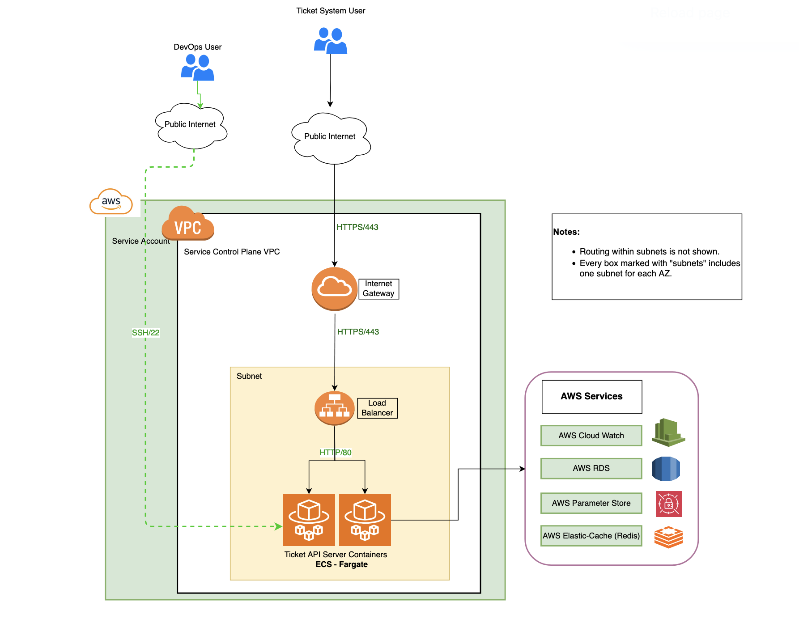

# FastAPI Ticket Management System

A cloud-native ticketing platform for support and operations, built with FastAPI, PostgreSQL, Redis (ElastiCache), and AWS. Features JWT authentication, Slack notifications, and full CRUD for tickets.

---

## Features
- User registration and JWT authentication
- Ticket CRUD (create, read, update, delete)
- PostgreSQL for persistent storage
- Redis/ElastiCache for caching
- Slack notifications on ticket events
- AWS ECS, RDS, and Terraform-based infrastructure

---

## Project Structure
```
fastApiProject/
├── main.py                # FastAPI app entry point
├── requirements.txt       # Python dependencies
├── app/
│   ├── auth/              # Authentication logic
│   ├── daoLayer/          # Database models, mappers, and service objects
│   ├── v1/routers/        # API routers (e.g., tickets)
│   ├── apiSchemas.py      # Pydantic schemas
│   └── crud.py            # CRUD operations
└── ...
```

---

## API Endpoints
| Method | Endpoint                | Description                | Auth Required |
|--------|-------------------------|----------------------------|--------------|
| POST   | `/register`             | User registration          | No           |
| POST   | `/token`                | User login (JWT)           | No           |
| GET    | `/tickets/`             | List all tickets           | Yes          |
| POST   | `/tickets/`             | Create a new ticket        | Yes          |
| GET    | `/tickets/{id}`         | Get ticket by ID           | Yes          |
| PUT    | `/tickets/{id}`         | Update ticket by ID        | Yes          |
| DELETE | `/tickets/{id}`         | Delete ticket by ID        | Yes          |
| GET    | `/redis-health`         | Redis health check         | Yes          |
| GET    | `/health`               | App health check           | No           |

---

## Architecture Diagram



For detailed design and data flows, see the [Design Document](./assets/Design%20Document.md) and [docs/architecture.md](./docs/architecture.md).

---

## Quickstart

```bash
git clone <your-repo-url>
cd tickets
python3 -m venv venv
source venv/bin/activate
pip install -r requirements.txt
uvicorn main:app --reload
```
- API: [http://127.0.0.1:8000](http://127.0.0.1:8000)
- Docs: [http://127.0.0.1:8000/docs](http://127.0.0.1:8000/docs)

---

## 📚 Full Documentation

See the [Project Documentation](https://<your-gh-username>.github.io/<repo-name>/) for:
- Architecture & Data Flows
- AWS/Terraform Infrastructure
- Docker/ECS Deployment
- Redis Caching & Testing
- Secrets Management
- Test Plan, FAQ, and more

Or browse the `/docs` folder in this repo.

---

## License
MIT
---

For questions, see the [FAQ](./docs/faq.md) or open an issue.
