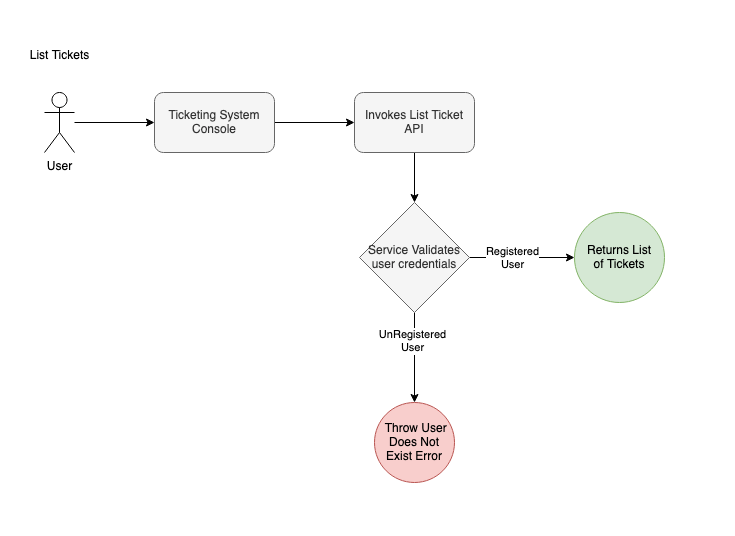
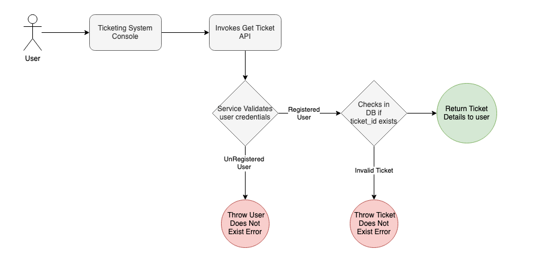
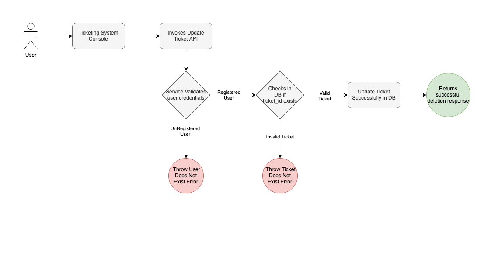
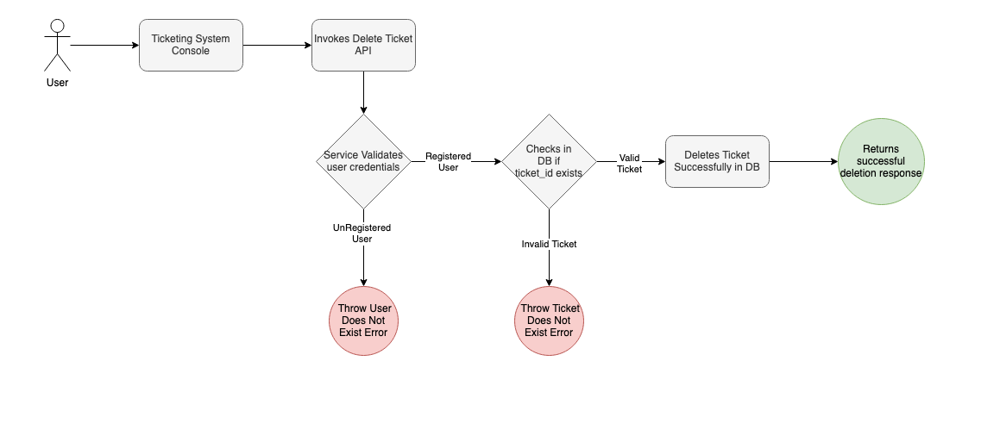

# Ticketing System - Design Document

##### Author: Shikha Singh

## Terminology and components

| Term/Component      | Description                                                                                 |
|---------------------|---------------------------------------------------------------------------------------------|
| Ticket              | A record representing a user request, issue, or task in the system.                        |
| User                | An individual who can create, update, or manage tickets.                                   |
| FastAPI             | Python web framework used for building the backend REST API.                               |
| PostgreSQL          | Relational database used for persistent storage of tickets and users.                      |
| Redis               | In-memory data store used for caching frequent ticket queries.                             |
| ECS Fargate         | AWS service for running containers without managing servers, used for backend deployment.   |
| RDS                 | AWS managed relational database service, hosting PostgreSQL.                               |
| ElastiCache         | AWS managed Redis service for caching.                                                     |
| ALB                 | AWS Application Load Balancer, routes traffic to backend services.                         |
| JWT                 | JSON Web Token, used for secure authentication and route protection.                       |
| Slack Webhook       | Integration for sending real-time ticket notifications to Slack channels.                   |
| Docker              | Containerization platform for packaging and deploying application components.               |
| Terraform           | Infrastructure as Code tool for provisioning AWS resources.                                |
| AWS                 | Amazon Web Services, the cloud platform hosting all infrastructure components.             |
## Problem Statement

In large organizations , Slack is widely used for real-time collaboration. However, operational issues—such as access failures or service disruptions—are often reported informally through Slack messages. This results in several key challenges:

❌ Lack of structure: Issues are easily lost or overlooked due to unorganized reporting

❌ No accountability: There's no clear ownership or follow-through on reported problems

❌ Limited auditability: There's no centralized system to track support history or trends

## Proposed Solutions

Deploy a unified, intelligent ticketing platform that bridges Slack and a web-based interface to transform how operational issues are captured and resolved. This system will:

✅ Streamline issue reporting by enabling users to raise tickets instantly via Slack or a user-friendly UI

✅ Drive ownership and accountability with automated ticket assignment, status tracking, and SLA enforcement

✅ Enhance team responsiveness through real-time Slack alerts that keep engineers and stakeholders in sync

#### Scope 

* Ticket Management: Web UI with full CRUD support

* Slack Integration: Automated notifications on ticket creation and update for real-time team awareness

* Backend: FastAPI-based REST API with PostgreSQL and Redis for storage and performance

* Security: JWT-based authentication for secure user access

* Cloud Deployment: Hosted on AWS (ECS Fargate, RDS, ElastiCache), provisioned via Terraform

* Monitoring: Basic logging and visibility using AWS CloudWatch

#### Out of Scope 

* Slack Ticket Creation: No slash commands or interactive modals for creating tickets via Slack

* Email Notifications: No support for email alerts or escalation workflows

* Workflow Automation: No SLA-based auto-assignment or ML-driven routing

* Advanced Security: OAuth2 and role-based access control not implemented

* Third-Party Integrations: No syncing with Jira, Zendesk, or ServiceNow

* Mobile App: No native app; web UI is mobile responsive only

* Analytics: No dashboards or advanced reporting — limited to basic status counts

## High Level Solution & Approach

The ticketing system is designed as a cloud-native, microservices-based application to ensure scalability, reliability, and ease of maintenance. The core solution leverages FastAPI for the backend REST API, PostgreSQL for persistent data storage, Redis for caching, and AWS-managed services for deployment and infrastructure.

### Key Solution Elements

- **Backend API:**  
  Built with FastAPI, providing endpoints for user registration, authentication, and full ticket lifecycle management (create, read, update, delete). JWT-based authentication secures all protected routes.

- **Database:**  
  PostgreSQL is used for reliable, relational data storage. Key fields are indexed (e.g., status, assignee, reporter, created_at) to optimize query performance and support high-throughput operations.

- **Caching:**  
  Redis (optionally via AWS ElastiCache) is integrated to accelerate frequent ticket queries and reduce database load.

- **Notifications:**  
  Slack webhooks are triggered on ticket creation and updates, ensuring real-time visibility for support teams.

- **Infrastructure & Deployment:**  
  The solution is containerized using Docker and deployed on AWS ECS Fargate for managed, serverless compute. Infrastructure is provisioned and managed using Terraform, enabling repeatable and auditable deployments. AWS services such as RDS, ElastiCache, ALB, to provide scalable, secure, and highly available infrastructure.

- **Security:**  
  All sensitive operations require JWT tokens. Secrets and credentials are managed via AWS SSM Parameter Store and environment variables.

- **Testing & Quality:**  
  Comprehensive unit and integration tests are implemented using pytest and FastAPI’s TestClient, with CI pipelines ensuring code quality and reliability.

This approach ensures the system is robust, scalable, and maintainable, with clear separation of concerns and best practices for cloud-native application development.

## System Design  

###  Availability, Scalability

The Autodesk Ticketing Platform is designed with high availability and scalability at its core. The application is hosted on AWS ECS Fargate behind an internet-facing Application Load Balancer (ALB), ensuring reliable request routing across multiple Availability Zones.
This architecture eliminates single points of failure and enables seamless failover in the event of a service disruption. 

Services are stateless, allowing containers to be replicated or restarted without affecting system integrity. 

Scalability is achieved through horizontal scaling of containers based on load, while backend services like PostgreSQL (via RDS) and Redis (via ElastiCache) are managed by AWS to support automated backups, failover, and performance tuning. 

This cloud-native setup ensures the platform can scale efficiently with demand while maintaining resilience and responsiveness.

###  Database, Data Model

PostgreSQL was selected for this project due to its strong support for structured, relational data and transactional consistency. 
Tickets inherently have relationships (e.g., users, assignees, statuses), and the need for features like filtering, sorting, pagination, and constraints (e.g., unique ticket IDs, length limits) made a relational database a natural fit.

In contrast, NoSQL databases like MongoDB are better suited for unstructured or schema-less data and high-velocity, distributed writes — which aren’t core requirements here. 
PostgreSQL also enables rich queries, joins, indexing, and enforcement of business rules via schemas, which improves maintainability and data integrity in a support-focused platform.

##### Ticket Table – Data Model
| Field         | Type              | Description                          | Constraints / Defaults        |
|---------------|-------------------|--------------------------------------|--------------------------------|
| `id`          | UUID              | Unique ticket identifier             | Primary Key, UUIDv4, Non-null |
| `title`       | String(255)       | Title of the ticket                  | Required                       |
| `description` | Text              | Detailed ticket description          | Optional                       |
| `created_by`  | Integer           | ID of user who created the ticket    | Default: 1                     |
| `created_at`  | DateTime          | Timestamp of creation                | Auto-filled (UTC)              |
| `severity`    | String(50)        | Severity level (e.g., high, low)     | Required                       |
| `status`      | String(50)        | Ticket status                        | Default: `open`                |
| `comments`    | String(255)       | Optional comments or updates         | Nullable                       |
| `category`    | String(50)        | Ticket category or domain            | Optional                       |
| `assignee`    | String(255)       | Person/team responsible for handling | Optional                       |

##### User Table – Data Model
| Field         | Type        | Description                          | Constraints / Defaults         |
|---------------|-------------|--------------------------------------|---------------------------------|
| `id`          | Integer     | Unique user ID                       | Primary Key, Non-null, Unique  |
| `name`        | String(255) | Full name of the user                | Required                        |
| `email`       | String(255) | User email address                   | Optional                        |
| `phone_number`| Integer     | Contact number                       | Optional                        |
| `address`     | Text        | User's physical address              | Optional                        |
| `department`  | String(255) | Department the user belongs to       | Optional                        |
| `active`      | Boolean     | Whether the user is active           | Optional                        |
| `created_at`  | DateTime    | Timestamp of user creation           | Auto-filled (UTC)               |
| `password`    | String(100) | Hashed password                      | Required                        |

### Dependencies

| Component         | Technology     | Purpose                                 | Hosting/Source        |
|------------------|----------------|-----------------------------------------|------------------------|
| Backend API       | FastAPI        | REST API for ticket operations          |  GitHub          |
| Database          | PostgreSQL     | Persistent storage of tickets/users     | AWS RDS                |
| Caching Layer     | Redis          | Performance for frequent ticket queries | AWS ElastiCache        |
| Auth              | JWT            | Secure login / route protection         | FastAPI + PyJWT        |
| Notifications     | Slack Webhook  | Real-time ticket alerts                 | Slack API              |

### Data Flows Diagram

#### User Creation & Login

* ##### Create New User

* ##### User Login

#### Ticket CRUD Operations
* ##### Create Ticket

* ##### List Ticket

* ##### Get Ticket

* ##### Update Ticket

* ##### Delete Ticket

  
### Security 

* Enforced JWT-based authentication for all API routes using FastAPI dependency injection

* Tokens are validated on each request to ensure only authorized users can create, update, or delete tickets

* HTTPS is enforced via AWS ACM + ALB, ensuring encrypted communication in transit

* Database is encrypted at rest using AWS RDS + KMS, protecting sensitive ticket and user data

The ticketing system prevents SQL injection attacks through the following measures:

- **ORM Usage:**  
  All database operations use SQLAlchemy ORM, which automatically parameterizes queries. This ensures that user input is never directly interpolated into raw SQL statements.

- **No Raw SQL from User Input:**  
  The application does not construct SQL queries by concatenating or interpolating user-provided data. All filters and lookups (e.g., by status, assignee, ticket ID) are performed using SQLAlchemy's query methods, which safely handle parameters.

- **Input Validation:**  
  Pydantic models are used to validate and sanitize incoming request data before it reaches the database layer.

- **Parameterized Queries:**  
  Even in cases where raw SQL might be used (such as for index creation), parameters are never directly inserted from user input.

The ticketing system is designed to prevent Cross-Site Scripting (XSS) attacks through several layers of defense:

- **Input Validation:**  
  All incoming data is validated and sanitized using Pydantic models, ensuring that only expected data types and formats are accepted.

- **Output Encoding:**  
  The frontend (e.g., React) is responsible for properly encoding and escaping any user-generated content before rendering it in the browser, preventing malicious scripts from executing.

- **No Direct HTML Rendering:**  
  The backend API does not return raw HTML or render templates with user input, reducing the risk of reflected or stored XSS.

By combining input validation, output encoding, and secure frontend practices, the system minimizes the risk of SQL &  XSS vulnerabilities.

### Slack Integration 

* Slack notifications are triggered automatically on ticket creation and ticket updates

* Messages include key ticket details like title, status, and severity to ensure team visibility

* Designed to improve cross-functional awareness and reduce time to triage

* Easily extendable to support Slack threading, channel-specific routing, or approval workflows

### Performance: Database Indexing

To ensure efficient query performance and scalability as the number of tickets grows, the system implements database indexing on key columns frequently used in queries and filters. Indexes are created on the following fields in the `tickets` table:

- **status**: Enables fast filtering of tickets by their status (e.g., open, closed, in-progress).
- **created_at**: Supports efficient sorting and retrieval of tickets based on creation time, especially for recent activity.
- **reporter**: Allows quick lookup of tickets created by a specific user.
- **assignee**: Facilitates rapid filtering of tickets assigned to a particular user.

These indexes are created automatically during database initialization to optimize the most common access patterns, such as listing tickets by status, sorting by creation date, and filtering by assignee or reporter. Proper indexing significantly reduces query latency and improves the responsiveness of the ticket listing and search APIs, especially under high load or with large datasets.

### Performance: Caching

To enhance performance and reduce database load, the ticketing system integrates Redis as a caching layer. Ticket data is cached by ID and optionally for bulk fetches, using a configurable TTL to maintain freshness. The cache is automatically invalidated or updated after ticket modifications. 
Redis runs via AWS ElastiCache in production and locally during development.

The cache key is generated by combining the ticket list query parameters into a single string: 
`cache_key = f"tickets:all:{status}:{sort_by}:{assignee}"`

### APIs

#### Ticket API Endpoints

| Method | Endpoint                 | Description                | Request Body (JSON)                                                                 | Response (JSON)                        | Auth Required |
|--------|--------------------------|----------------------------|-------------------------------------------------------------------------------------|-----------------------------------------|--------------|
| GET    | `prod_endpoint/tickets/` | List all tickets           | **Headers:** `Authorization: Bearer <token>` **Query params:** - `status` (str, optional) - `sort_by` (str, optional) - `assignee` (str, optional) | List of Ticket objects                  | Yes          |
| POST   | `prod_endpoint/tickets/`           | Create a new ticket        | **Headers:** `Authorization: Bearer <token>` **Body:** `{ "title": str, "description": str, "status": str, "assignee": str, "reporter": str }` | Ticket object                           | Yes          |
| GET    | `prod_endpoint/tickets/{id}`       | Get ticket by ID           | **Headers:** `Authorization: Bearer <token>`                                      | Ticket object or 404 if not found       | Yes          |
| PUT    | `prod_endpoint/tickets/{id}`       | Update ticket by ID        | **Headers:** `Authorization: Bearer <token>` **Body:** `{ "status": str (optional), "description": str (optional) }` | Updated Ticket object or 404 if missing | Yes          |
| DELETE | `prod_endpoint/tickets/{id}`       | Delete ticket by ID        | **Headers:** `Authorization: Bearer <token>`                                      | `{ "success": true }` or 404 if missing | Yes          |

#### Auth API Endpoints

| Method | Endpoint           | Description           | Request Body (JSON)                                  | Response (JSON)                        | Auth Required |
|--------|--------------------|-----------------------|------------------------------------------------------|-----------------------------------------|--------------|
| POST   | `prod_endpoint/login`   | User login            | `{ "email": str, "password": str }`                  | `{ "access_token": str, "token_type": "bearer" }` | No           |
| POST   | `prod_endpoint/register`| User registration     | `{ "email": str, "password": str, ... }`             | User object or error                    | No           |

### Infrastructure Deployment

- Set AWS Credentials. Run `./set-dummy-aws-creds.sh` to set AWS credentials for Terraform validation or testing.
- The `infrastructure` folder contains all Terraform code for provisioning AWS resources required by the ticketing platform.
- It automates deployment of ECS Fargate (for FastAPI backend), RDS PostgreSQL (database), ElastiCache Redis (caching), and VPC networking.
- All resources are defined as code to ensure repeatable, auditable, and consistent cloud environments.
- To deploy, run `terraform-init.sh`,`terraform-plan.sh` and `terraform-apply.sh` from the `build` directory after configuring variables.
- This setup supports high availability, scalability, and secure cloud-native operations as described in the system design.

### Application Deployment 

- Set AWS Credentials:
   Run `./set-dummy-aws-creds.sh` to set AWS credentials for Terraform validation or testing.

- Configure Variables:
   Edit Terraform variable files (e.g., `terraform.tfvars`) in the `infrastructure` folder to match your AWS environment.

- Build & Push Docker Image:  
   Execute `./build.sh` to build the FastAPI Docker image and push it to the ECR repository.

- Deploy to ECS Fargate:  
   Run `./deploy.sh` to update the ECS Fargate service with the new Docker image. 

- Verify Deployment:
   Check the AWS Console to ensure all services are running and the application is accessible via the ALB endpoint.

## Test Plan

A comprehensive test plan to ensure the correctness, security, and reliability of the FastAPI-based ticketing system.
[docs/detailed-test-plan.md](../docs/detailed-test-plan.md)

## Appendix 

- Overview of AWS services and third-party integrations used:
  - [Amazon Web Services (AWS)](https://aws.amazon.com/)
  - [ECS Fargate](https://aws.amazon.com/fargate/)
  - [RDS (PostgreSQL)](https://aws.amazon.com/rds/postgresql/)
  - [ElastiCache (Redis)](https://aws.amazon.com/elasticache/redis/)
  - [Route 53](https://aws.amazon.com/route53/)
  - [Application Load Balancer (ALB)](https://aws.amazon.com/elasticloadbalancing/application-load-balancer/)
  - [AWS SSM Parameter Store](https://docs.aws.amazon.com/systems-manager/latest/userguide/systems-manager-parameter-store.html)
  - [Slack Webhooks](https://api.slack.com/messaging/webhooks)
## Technology Links

- [FastAPI](https://fastapi.tiangolo.com/)
- [SQLAlchemy](https://www.sqlalchemy.org/)
- [PostgreSQL](https://www.postgresql.org/)
- [Redis](https://redis.io/)
- [Docker](https://www.docker.com/)
- [Terraform](https://www.terraform.io/)
- [PyJWT](https://pyjwt.readthedocs.io/)
- [React](https://react.dev/)
- [TypeScript](https://www.typescriptlang.org/)
- [pytest](https://docs.pytest.org/)