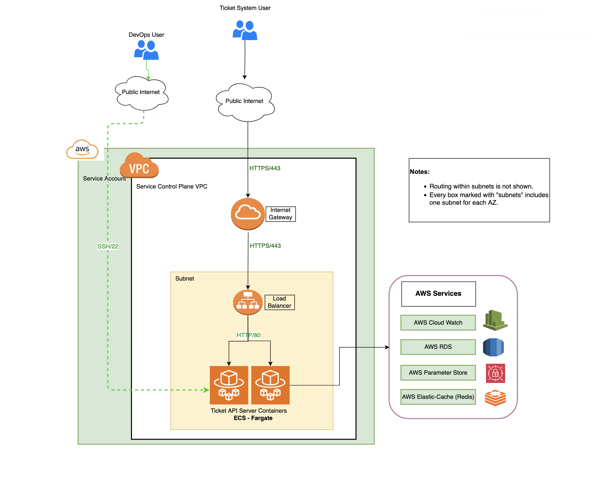
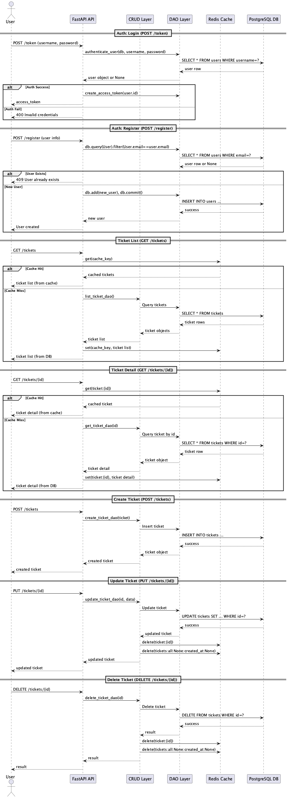
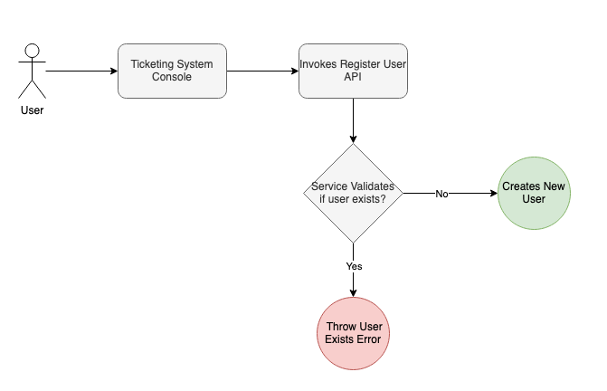
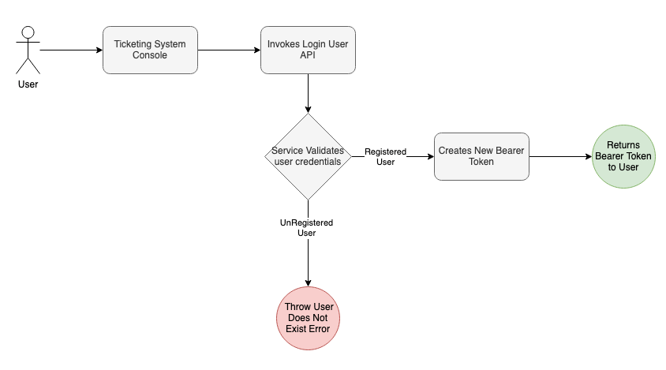
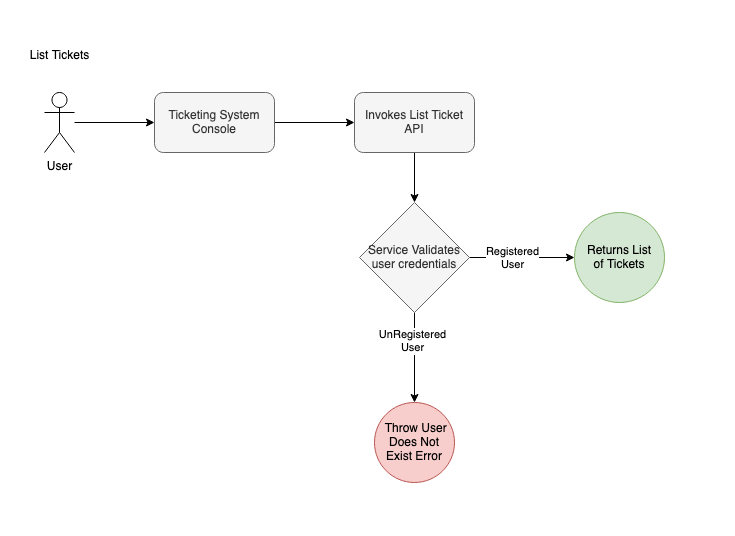
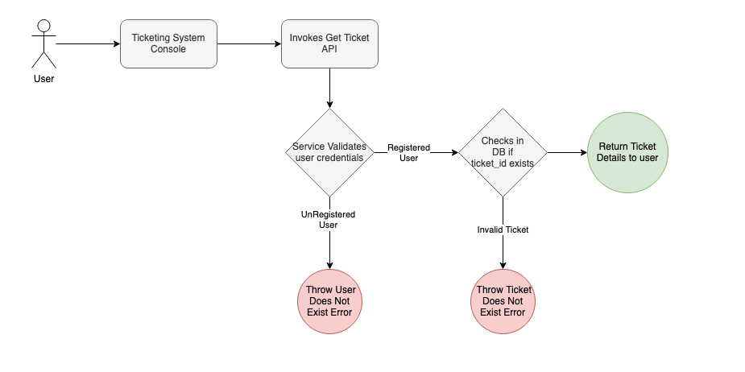
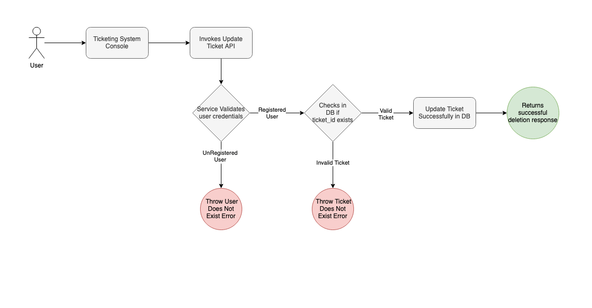
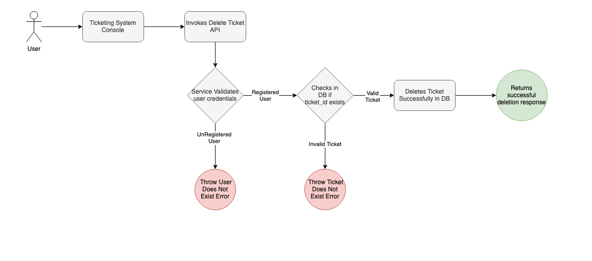
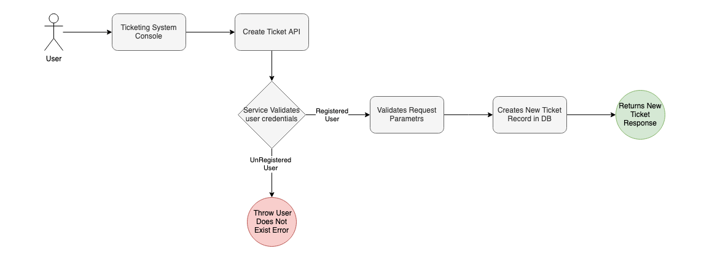
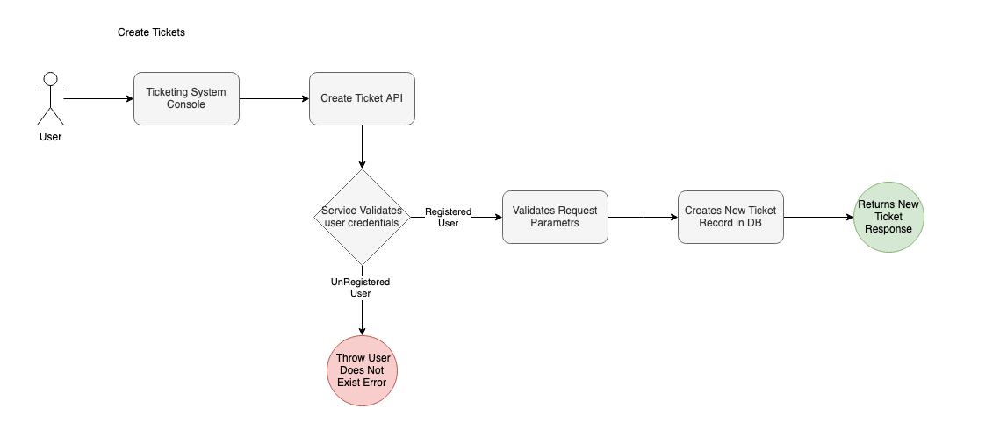

# Architecture & Data Flows

## System Architecture

## Sequence Diagram

## Data Flow Diagrams

### User Creation

### User Login

### List Tickets

### Get Ticket

### Update Ticket

### Delete Ticket

### Create Ticket

### Other Flows

For field-level and table design, see the [Design Document](../assets/Design%20Document.md).
